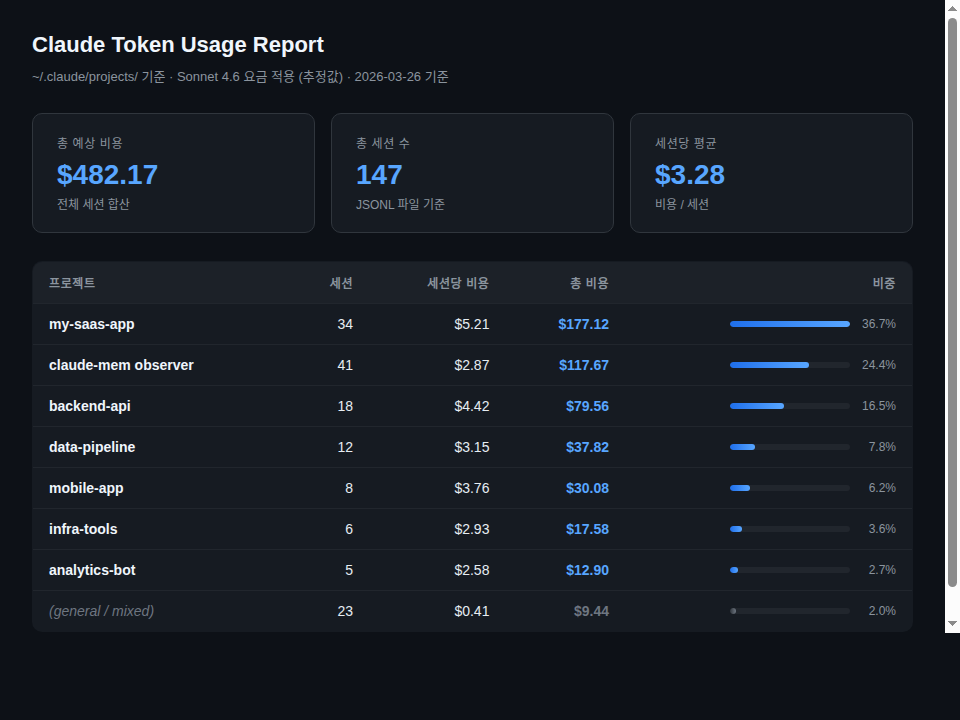

# claude-skills

Claude Code skills by Oliver Cho — install once, use forever.

> **Scope:** Practical productivity skills for Claude Code. Monitor your sessions via Telegram, measure what things cost, diagnose risk in your codebase, and watch GitHub repos for updates — all without leaving your terminal.

---

## Skills

### `/claude-telegram-hooks` — Telegram Session Monitor

Bridges your Claude Code terminal to Telegram in real time. Every message you send, every response Claude gives, every permission prompt and context compaction — forwarded to your phone automatically.

**What it sets up:**
- **UserPromptSubmit hook** — your messages → Telegram with a configurable display name
- **Stop hook** — Claude's responses → Telegram automatically
- **Notification hook** — attention alerts when Claude needs input or permission
- **PreCompact hook** — warns you before context gets compacted

**Why it matters:**
Long-running Claude Code tasks need monitoring. This lets you step away from the terminal, get notified when something needs your attention, and keep a timestamped log of every session — without checking back manually.

---

### `/token-usage` — Cost Analyzer

Parses your Claude Code transcript history to calculate per-project token usage and estimated cost. Generates a dark-themed HTML report.

**What it does:**
- Reads all `~/.claude/projects/**/*.jsonl` transcripts
- Classifies sessions by project name from folder structure and content
- Calculates cost breakdown: input, cache write, cache read, output
- Outputs: HTML report at `/tmp/token_usage_detailed.html` + text summary

**Cost basis (claude-sonnet-4-6):** $3.00/M input · $3.75/M cache write · $0.30/M cache read · $15.00/M output

**Why it matters:**
You can't optimize what you can't measure. This shows which projects are burning the most tokens — usually a sign of missing cache hits, overly long system prompts, or sessions that should have been compacted.

**Usage:** `"show token usage"` · `"비용 확인해줘"` · `"얼마나 썼어"`



---

### `/hotspot` — Git Risk Analyzer

Diagnoses codebase risk from git history alone — no code reading required. Run this before onboarding to a new project or starting a risky refactor.

**What it surfaces:**
- **Hot files** — files changed most frequently (highest churn = highest risk)
- **Bus factor** — which files only one person has touched
- **Firefighting frequency** — commits with "fix", "hotfix", "urgent" patterns
- **Team momentum** — recent activity distribution across contributors
- **Staleness** — files not touched in months despite active codebase

**Why it matters:**
The riskiest files in a codebase are almost never the most complex ones — they're the most frequently changed ones. Git history reveals this in seconds. Knowing the hot zones before you read the code changes everything about where you start.

**Usage:** `"hotspot 분석해줘"` · `"위험한 파일 찾아줘"` · `"run hotspot"`

---

### `/github-watch` — GitHub Repo Watcher

Watches GitHub repositories for new commits and sends a Telegram notification when updates are detected. Zero dependencies — pure Python stdlib, no API tokens required for public repos.

**What it does:**
- Polls the GitHub API for new commits on any public repository
- Stores the last-seen SHA in a local state file
- Sends a Telegram message listing new commits (author, message, date) when a change is detected
- Installs itself as a scheduled job (cron on Linux/Mac, Task Scheduler on Windows)

**Supports:** Linux ✅ / macOS ✅ / Windows ✅

**Why it matters:**
Keeping up with fast-moving repos manually is noise. This runs silently in the background and only pings you when something actually changes — useful for tracking research repos, dependencies, or any project where you care about new commits.

**Usage:**
```
/github-watch add owner/repo    → start watching a repo
/github-watch list              → see all watched repos
/github-watch remove owner/repo → stop watching
/github-watch test              → send a test Telegram message
```

**Requirements:** Python 3.6+, Telegram bot token in `~/.claude/channels/telegram/.env`

---

## Installation

### Plugin Marketplace (recommended)

Add to `~/.claude/settings.json`:

```json
"extraKnownMarketplaces": {
  "olivercho": {
    "source": { "source": "github", "repo": "olivercho/claude-skills" }
  }
}
```

Then open `/plugins` in Claude Code and search for any skill name.

### Manual

```bash
SKILLS_DIR=~/.claude/skills

mkdir -p $SKILLS_DIR/{claude-telegram-hooks,token-usage,hotspot,github-watch}

cp skills/claude-telegram-hooks/SKILL.md $SKILLS_DIR/claude-telegram-hooks/SKILL.md
cp skills/token-usage/SKILL.md           $SKILLS_DIR/token-usage/SKILL.md
cp skills/hotspot/SKILL.md               $SKILLS_DIR/hotspot/SKILL.md
cp skills/github-watch/SKILL.md          $SKILLS_DIR/github-watch/SKILL.md
```

---

## Recommended Flow

**Starting a new project:**
```
/hotspot                  → understand risk before touching anything
/claude-telegram-hooks    → set up monitoring so you can step away
```

**Ongoing:**
```
/token-usage              → periodic cost check (weekly or per milestone)
/github-watch add owner/repo → track repos you care about
```

| Skill | When to run | Frequency |
|-------|-------------|-----------|
| `/hotspot` | Before reading unfamiliar code | On-demand |
| `/claude-telegram-hooks` | Once per machine | One-time setup |
| `/token-usage` | Cost visibility | Periodic |
| `/github-watch` | Tracking repos for updates | One-time setup per repo |

---

## License

MIT
